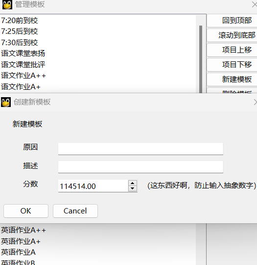

<p align="center">
  
</p>
<h1 align="center">欢迎使用 班寄管理 👋</h1>
<p align="center">更好的班级管理</p>
<div align="center">
  <a href="#-关于本项目">关于</a> •
  <a href="#-演示">演示</a> •
  <a href="#-开始使用">开始使用</a> •
  <a href="#-to-do-list">TODO</a>
</div>


> # **Tips:**
>
> 给自己做的班级优化大师（？（不要管我的抽象命名和抽象代码结构awa）
> 现在还是毛坯,不想写ui啊啊啊

## 🤔 关于本项目

- 由Python编写,PySide6作为ui
- 支持自定义学生/班级信息
- 快捷常规分统计系统
  **🎲抽象功能(awa)**
  - 1.播放音乐
  - 2.随机抽答系统（带音效的摇号点名功能）--> [TODO](?tab=readme-ov-file#%EF%B8%8F-todo)
  - 3.班级运势日报 --> [TODO](?tab=readme-ov-file#%EF%B8%8F-todo)
  - 4.速记便签墙（支持手写输入的电子白板）--> [TODO](?tab=readme-ov-file#%EF%B8%8F-todo)
- 直观的平铺学生界面；
- 提供快捷的班级小工具
- ...

## ✨ 演示

`班寄管理` 能做到简要学生管理常规分操作

- （界面还只是待修改的版本，看着有点抽象，将就吧）

### 基本操作

1. **添加扣/加分模板**

<p align="center">
  
</p>

1. **分数统计**

<p align="center">
  
</p>
<table>
  <tr>
    <!--
    <td width="33%"></td>
    <td width="33%"></td>
    <td width="33%"></td>
    -->
    <td width="33%"></td>
    <td width="33%"></td>
    <td width="33%"></td>
  </tr>
  <tr>
    <td align="center">模板化评分</td>
    <td align="center">数据可视化</td>
    <td align="center">卡片式界面</td>
  </tr>
</table>

### 视频演示

[](https://www.bilibili.com/video/BV1uT4y1P7CX)

## ♿ 开始使用

### - 以debug运行:

```
git clone https://gitee.com/JustNothing_1021/Class-Manager.git
cd Class-Manager
pip install -r requirements.txt -i https://pypi.tuna.tsinghua.edu.cn/simple
python main.py
```

> #### **Tips:**
>
> "-i https://pypi.tuna.tsinghua.edu.cn/simple" 为使用清华镜像源,加速下载;不用可忽略

- (才不是因为懒不想编译!)


| 组件               | 版本      | 备注                         |
| ------------------ | -------- | ---------------------------- |
| Python             | ≥3.8     | 推荐3.8.10+                  |
| PySide6            | ≥6.6.3.1 | UI组件                       |
| PySide6_Addons     | ≥6.6.3.1 | UI组件                       |
| PySide6_Essentials | ≥6.6.3.1 | UI组件                       |
| ......             | ≥......  | 详见 'requirements.txt' 内容 |

## ✔️ TO DO List

- ❌ 全局UI重构
- ✅ 更详细的学生信息
- ✅ 添加扣/加分模板
- ✅ 快捷统计系统
- ✅ 学生信息面板
- ✅ 班级信息面板
- ❌ 班级小工具
  -  ✅ 抽答系统
  -  ✅ 播放音乐
  -  ❌ 速记便签墙
  -  ❌ 班级运势
- ❌ 从其他格式(Excel)中解析导入
- ❌ 班级信息修改面板
- ❌ 学生添加/删除面板
- ❌ 开放捐赠入口
- ❌ 插件功能

到 [议题](https://gitee.com/JustNothing_1021/Class-Manager/issues) 页面查看所有被请求的功能 (以及已知的问题) 。

## 🤝 参与贡献

如果这个项目对您有帮助，请点亮 Star⭐️ 星标！
欢迎贡献、问题反馈和新功能请求。<br />
请查阅 [议题](https://gitee.com/JustNothing_1021/Class-Manager/issues) 页面后进行贡献<br />
- 请注意: 在提交您的贡献之前阅读 [贡献准则](https://gitee.com/JustNothing_1021/Class-Manager/blob/master/CONTRIBUTING.md) 以后参与贡献

## 📝 LICENSE

[](https://www.gnu.org/licenses/gpl-3.0.html)
本项目采用 [GPL v3.0](https://gitee.com/JustNothing_1021/Class-Manager/blob/master/LICENSE) 许可协议分发。

```legal
本程序是自由软件🧊
```

_**该README由 [baiyao105](https://gitee.com/baiyao105) 编写**_
